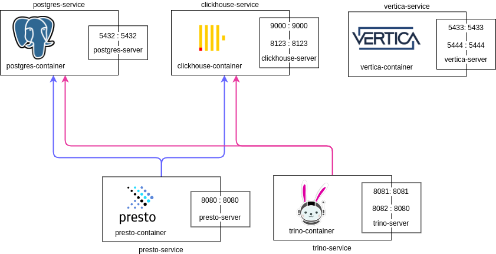

# Data-diff testing

A uni project dedicated to software testing.\
The goal is to conduct a testing cycle on chosen product - for that purpose, our group, called the Brazilian Lift of Death, selected a tool called [data-diff](https://github.com/datafold/data-diff).

## Environment setup

The tests will be conducted on local environments (more on that in upcoming documentation) with all the secondary services, possibly with auxilary testing tools, containerised.

### Architecture overview
The graphics below describe the composed container architecture. 



### Running docker compose
One has to install docker along with docker-compose on their machine (with accordance to the possesed OS). Then it's just a matter of running the command ```docker compose up```.

### Running presto

    docker exec -it presto-container ./bin/presto 