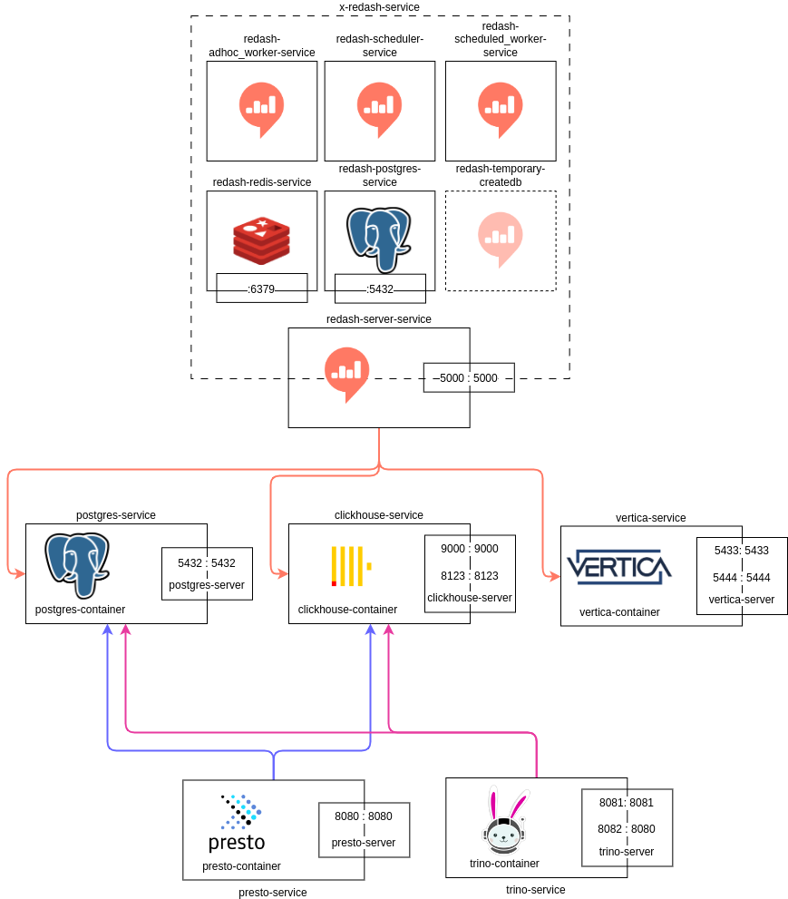

# Data-diff testing

A uni project dedicated to software testing.\
The goal is to conduct a testing cycle on chosen product - for that purpose, our group, called the Brazilian Lift of Death, selected a tool called [data-diff](https://github.com/datafold/data-diff).

## Environment setup

The tests will be conducted on local environments (more on that in upcoming documentation) with all the secondary services, possibly with auxilary testing tools, containerised.

### Running docker compose
One has to install docker along with docker-compose on their machine (with accordance to the possesed OS). Then it's just a matter of running the command ```docker compose up```.

### Architecture
The graph below describes the composed container architecture. 



Presto and Trino (Younger brother of trino, stemming from the same project) are query engines, balancing the load between different databases (registered via .properties files in ```catalog``` folders). Postgres is a standard OLTP row-oriented database, Clichouse is a columnar OLAP solution, as well as Vertica (Community Edition), which is really not as easy to get known with as open source projects but at least I found [the documentation](https://docs.vertica.com/23.4.x/en/).

It is worth noting, that all the tree SQL databases above don't possess a web UI. Thus an auxiliary service of [Redash](https://github.com/getredash/redash) is run. Within it, one has to manually set up the database connectors, so that one can easily explore and modify their contents. More on that in [Configuring Redash](#configuring-redash)

### Configuration

Kept in the ```docker/variables.env``` as well as  are the following settings:

| Service Name                    | Component                       | Local Address    | User      | Password                        | Test-database   |
|----------------------------------|---------------------------------|------------------|-----------|---------------------------------|-----------------|
| postgres-service                 | PostgreSQL                      | localhost:5432  | postgres  | Password1                       | postgres        |
| clickhouse-service               | ClickHouse                      | localhost:8123  | clickhouse| Password1                       | clickhouse      |
| vertica-service                   | Vertica                         | localhost:5433  | dbadmin   | *No password*                       | vertica         |
| presto-service                   | Presto                          | localhost:8080  |           |                                 |                 |
| trino-service                    | Trino                          | localhost:8082  |           |                                 |                 |
| redash-server-service            | Redash Server                   | localhost:5000  | *To be configured manually* | *To be configured manually*|        |

### Configuring Redash

On the first login (and on any subsequent purge of the redash-dedicated volume) one has to create an account. It can be filed with fake data, yet, upon forgetting the password the volume has to be restarted - unless you provide real data and configure an email server within the ```variables.env``` file. 

Later on, connectors for PostgreSQL, ClickHouse and Vertica have to be configured following the convention used on the screenshots below:

| | |
|:-------------------------:|:-------------------------:|
|  Sign-up |    ClickHouse|
| PostgreSQL|   Vertica|

### Using the architecture

How to use the presto CLI directly on the docker image: [Link](https://prestodb.io/docs/current/installation/deploy-docker.html#installing-and-running-the-presto-docker-container), but with a small caveat, the command to be executed on containe will be ```/bin/presto```\
How to do the above, but from your local machine connecting to the docker? [Like that](https://prestodb.io/docs/current/installation/cli.html)\
Example of presto usage connested to a clichouse instance? [Got you](https://prestodb.io/docs/current/connector/clickhouse.html?highlight=clickhouse#querying-clickhouse)\
How to do the same with trino? [I'm glad you askn'](https://trino.io/docs/current/client/cli.html), with a similar caveat if run directly on the container: the command will simply be ```trino```.

